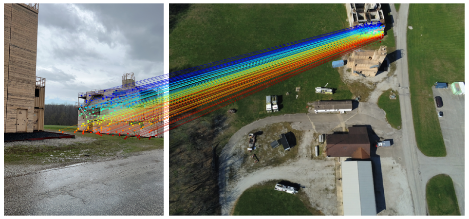

<div align="center">

# AerialMegaDepth: Learning Aerial-Ground Reconstruction and View Synthesis

[Khiem Vuong](https://www.khiemvuong.com/), [Anurag Ghosh](https://anuragxel.github.io/), [Deva Ramanan*](https://www.cs.cmu.edu/~deva), [Srinivasa Narasimhan*](https://www.cs.cmu.edu/~srinivas), [Shubham Tulsiani*](https://shubhtuls.github.io/)

(* denotes equal contribution/advising)

[[`arXiv`](https://arxiv.org/abs/2504.13157)]
[[`Project Page`](https://aerial-megadepth.github.io/)]
[[`3D Web Viewer`](https://aerial-megadepth.github.io/web-viewer/)]
[[`Bibtex`](#citation)]

${{\color{RoyalBlue}\Huge{\textsf{  CVPR\ 2025\ \}}}}\$

</div>

## Table of Contents

- [Installation](#installation)
- [Quick Start](#quick-start)
- [Evaluation](#evaluation)
- [Data Generation](#data-generation)
- [Acknowledgement](#acknowledgement)
- [Citation](#citation)
- [Issues](#issues)

## 📋 Before You Start...
Depending on what you're interested in:

- 🚀 **If you want to download pretrained checkpoints and run the demo**: you can continue reading below.

- 🛠️ **If you want to access or generate the dataset yourself**: please refer to [data_generation](data_generation) for full instructions.

## Installation

Below are the setup instructions (mostly following [MASt3R repo](https://github.com/naver/mast3r)). We follow the MASt3R setup since it encapsulates DUSt3R, but both should work similarly.


1. Clone the repository:
```bash
git clone --recursive https://github.com/kvuong2711/aerial-megadepth.git
cd aerial-megadepth/mast3r

# If you already cloned the repository, you can update the submodules:
# git submodule update --init --recursive
```
2. Create environment and install dependencies:
```bash
conda create -n aerialmd python=3.11 cmake=3.14.0
conda activate aerialmd 
conda install pytorch torchvision pytorch-cuda=12.1 -c pytorch -c nvidia  # use the correct version of cuda for your system
pip install -r requirements.txt
pip install -r dust3r/requirements.txt
pip install -r dust3r/requirements_optional.txt
```
3. Optional, compile the cuda kernels for RoPE (as in CroCo v2):
```bash
# DUST3R relies on RoPE positional embeddings for which you can compile some cuda kernels for faster runtime.
cd dust3r/croco/models/curope/
python setup.py build_ext --inplace
cd ../../../../
```

## Quick Start
Our finetuned checkpoints are fully compatible with the original DUSt3R/MASt3R/MASt3R-SfM codebase - if you already have them set up, you can simply swap the checkpoint for aerial-ground scenarios!

### Checkpoints

There are two options for downloading DUSt3R and MASt3R checkpoint finetuned on our AerialMegaDepth dataset:

1. You can use our huggingface_hub integration: the models ([aerial-dust3r](https://huggingface.co/kvuong2711/checkpoint-aerial-dust3r) or [aerial-mast3r](https://huggingface.co/kvuong2711/checkpoint-aerial-mast3r)) will be downloaded automatically.

2. Or, download the checkpoints manually (using [gdown](https://github.com/wkentaro/gdown), install using `pip install gdown`):

```bash
# you are inside aerial-megadepth/mast3r
mkdir -p checkpoints/
gdown --fuzzy "https://drive.google.com/open?id=1wSGpYwWeGn99J8dVWNkfefwmWMAH7LFT" -O checkpoints/  # checkpoint-aerial-dust3r.pth
gdown --fuzzy "https://drive.google.com/open?id=1LrRNUQRQZcVzcioyYHYYx9ImypSZpUq2" -O checkpoints/  # checkpoint-aerial-mast3r.pth
```

### Inference/Demo
We provide a few example images in the [assets](assets) folder for quick testing, including images from [ULTRRA challenge](https://sites.google.com/view/ultrra-wacv-2025) and [Accenture-NVS1](https://arxiv.org/pdf/2503.18711).

Each script (e.g., [demo_dust3r_nongradio.py](mast3r/demo_dust3r_nongradio.py)) contains predefined image paths to demonstrate typical use cases. You can modify the `image_list` variable inside the script to try different pairs. You can run inference using the following commands:

- DUSt3R demo code:
```bash
python demo_dust3r_nongradio.py --weights kvuong2711/checkpoint-aerial-dust3r

# or, if you downloaded the checkpoints manually:
# python demo_dust3r_nongradio.py --weights checkpoints/checkpoint-aerial-dust3r.pth
```

- MASt3R demo code:
```bash
python demo_mast3r_nongradio.py --weights kvuong2711/checkpoint-aerial-mast3r

# or, if you downloaded the checkpoints manually:
# python demo_mast3r_nongradio.py --weights checkpoints/checkpoint-aerial-mast3r.pth
```


## Evaluation

- [ ] **TODO:** Evaluation data will be released soon.

Once data is downloaded, run the evaluation script:
```bash
python eval.py \
    --weights checkpoints/checkpoint-aerial-dust3r.pth \
    --eval_data_dir data/eval_data_release
```
This script (adapted from [PoseDiffusion](https://github.com/facebookresearch/PoseDiffusion)) reports RRA and RTA at various degree thresholds.

## Data Generation
For instructions on how to download and/or generate the data, please refer to [data_generation](data_generation).

## Acknowledgement
This codebase builds upon many excellent open-source projects, such as [MegaDepth](https://www.cs.cornell.edu/projects/megadepth), [DUSt3R](https://github.com/naver/dust3r), [hloc](https://github.com/cvg/Hierarchical-Localization), [COLMAP](https://github.com/colmap/colmap), etc. We thank the respective authors for making their work publicly available.

## Citation
If you find our work to be useful in your research, please consider citing our paper:

```bibtex
@inproceedings{vuong2025aerialmegadepth,
  title={AerialMegaDepth: Learning Aerial-Ground Reconstruction and View Synthesis},
  author={Vuong, Khiem and Ghosh, Anurag and Ramanan, Deva and Narasimhan, Srinivasa and Tulsiani, Shubham},
  booktitle={Proceedings of the IEEE/CVF Conference on Computer Vision and Pattern Recognition},
  year={2025},
}
```

## Issues
If you have any problem/question/suggestion, feel free to create an issue or reach out directly to me via [email](mailto:kvuong@andrew.cmu.edu).